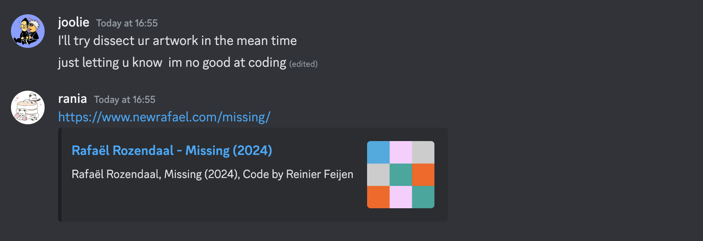
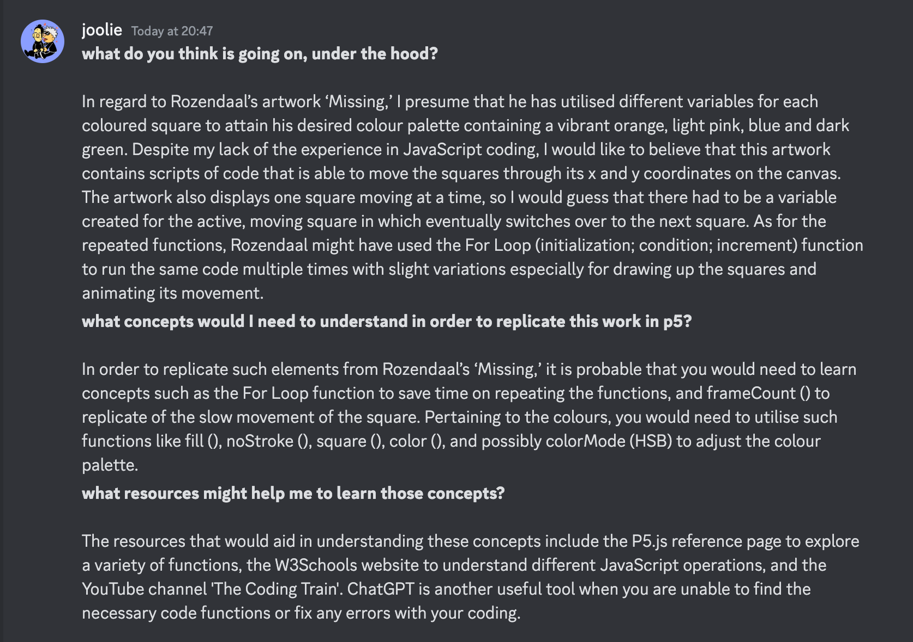

# Conversations with My Classmates

This post will display the discord discussions with 3 of my classmates. we will talk about Rafael Rozendaal the artwork I have chosen is missing and ask each of my classmates following questions:
What do you think is going on, under the hood?
What concepts would I need to understand in order to replicate this work in p5?
What resources might help me to learn those concepts?

# The first person I spoke to was joolie, after I asked her those questions she replied with this.

...

# The second person I spoke to was Travv.

# The third person was Lanchu Zheng

